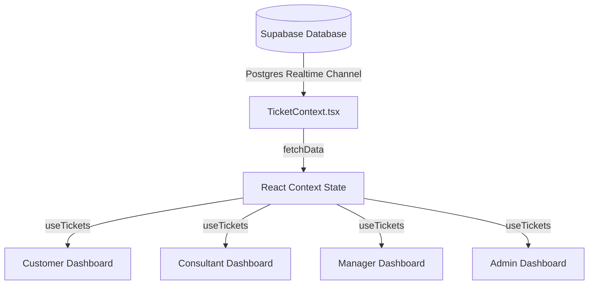

# Dashboard Data Freshness & Caching Audit

This document details the data fetching architectures, state synchronization pipelines, and freshness strategies implemented across the Customer, Consultant, Manager, and Admin dashboards.

---

## 1. Dashboard Fetching Architecture

All core dashboards consume data from the centralized `useTickets()` React Context hook defined in `src/context/TicketContext.tsx`.



### Dashboard Fetching Details

| Dashboard | Path | Data Sources Used | Fetching Mechanism |
| --- | --- | --- | --- |
| **Customer** | `/customer/dashboard` | `tickets`, `contracts` | Shared React Context State |
| **Consultant** | `/consultant/dashboard` | `tickets` | Shared React Context State |
| **Manager** | `/manager/dashboard` | `tickets` | Shared React Context State |
| **Admin** | `/admin/dashboard` | `tickets`, `contracts`, `profiles`, `audit_logs` (Direct), `health` (Direct) | Shared React Context + Direct Supabase API Queries |

---

## 2. Synchronization & Cache-Busting Mechanism

To prevent stale views and handle server-rendered routing caches, we use a multi-tiered freshness strategy:

### A. Postgres Schema Realtime Listener
A single, global Postgres Realtime subscription is established on the `public` schema inside `TicketContext.tsx`:
```typescript
const channel = supabase
  .channel('schema-db-changes')
  .on('postgres_changes', { event: '*', schema: 'public' }, () => {
    debouncedRefetch();
  });
```
This channel listens to any event (`INSERT`, `UPDATE`, `DELETE`) on any table. When a change is broadcasted, it schedules a debounced refetch.

### B. Debounced Refetch & Next.js Router Cache Invalidation
The `debouncedRefetch` helper runs 200ms after the last database event to batch rapid updates and avoid duplicate queries. It carries out two actions:
1. **`router.refresh()`**: Clears the client-side router cache for the active Next.js App Router segment. This forces server-rendered layout components and server actions to refresh.
2. **`fetchData()`**: Executes a parallel fetch of `profiles`, `tickets`, `contracts`, `contacts`, `kbArticles`, and `notifications` from Supabase, updating context state hooks.

### C. Direct Action Synchronization
Every local mutation (such as ticket updates, assigning consultants, log approvals, and comment additions) runs its Supabase query, updates local React state immediately, and calls `syncTickets()` (which triggers `debouncedRefetch()`), ensuring instant local responsiveness followed by secure backend alignment.

---

## 3. Stale Data Paths & Targeted Mitigations

### Stale Path 1: Next.js Client Route Caches
- **Risk**: Moving between dashboards or navigating away and back could show cached states due to Next.js route prefetching and layouts.
- **Mitigation**: Integrating `router.refresh()` inside the context debouncer ensures that layout states are always invalidated and synchronized when real-time events fire.

### Stale Path 2: Direct Sub-queries (Audit Logs)
- **Risk**: The Admin dashboard fetches audit logs directly from the `audit_logs` table. Because `audit_logs` is not part of the shared context states, mutations that log audits would not refresh the list in real-time.
- **Mitigation**: Setting up a dedicated `realtime-audit-logs` Postgres changes listener directly in the Admin Dashboard component ensures the logs list updates automatically on audit log insertion.

### Stale Path 3: Mock Data Fallback Infiltration
- **Risk**: Fallbacks using local storage or hardcoded lists could overwrite fresh Supabase data.
- **Mitigation**: We audited the workspace and verified that all local storage/mock fallbacks in the User, Consultant, and Manager list pages are strictly guarded with `if (!isSupabaseConfigured || !supabase)` checks, guaranteeing they never block Supabase updates when configured.
